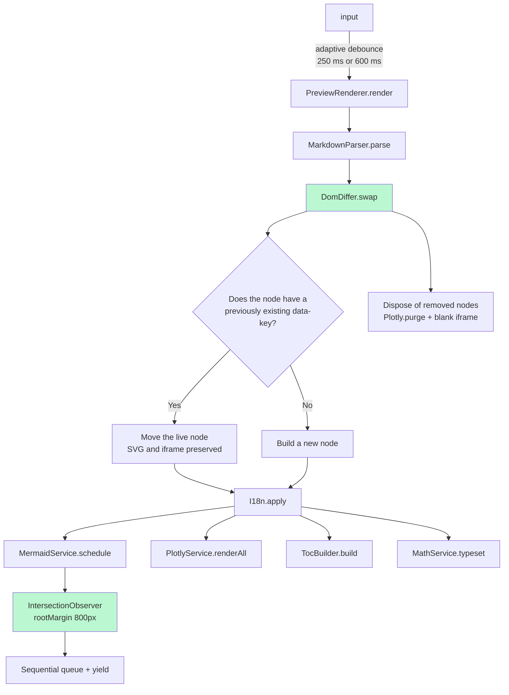

## 1. File Structure

```text
markdown-editor/
├── index.html
├── tools/download-vendors.sh
└── assets/
    ├── css/                       ← Original files + render.css (new)
    ├── vendor/                    ← Existing files + model-viewer.min.js (new)
    └── js/
        ├── core/
        │   ├── logger.js          ← Logger        — Controlled output by log level
        │   ├── utils.js           ← Utils         — Pure functions (hash, SVG, blob)
        │   ├── event-bus.js       ← EventBus      — Pub/sub + Events constants
        │   ├── dom.js             ← DOM           — Cache + event delegation
        │   ├── store.js           ← Store         — Shared state
        │   └── lazy-loader.js     ← LazyLoader    — Load libraries on demand
        ├── i18n/
        │   ├── translations.js    ← TRANSLATIONS
        │   └── i18n.js            ← I18n
        ├── content/
        │   └── default-document.js
        ├── services/
        │   ├── theme.service.js   ← ThemeService
        │   ├── storage.service.js ← StorageService (+ autosave)
        │   ├── mermaid.service.js ← MermaidService (lock + lazy queue)
        │   ├── plotly.service.js  ← PlotlyService
        │   └── math.service.js    ← MathService
        ├── parser/
        │   ├── highlighter.js     ← Highlighter
        │   ├── preprocessors.js   ← Preprocessors
        │   ├── block-registry.js  ← BlockRegistry + BaseBlock
        │   ├── blocks/             ← MermaidBlock, PlotlyBlock, MapBlock,
        │   │                         VideoBlock, Model3DBlock, CodeBlock
        │   └── markdown-parser.js  ← MarkdownParser
        ├── render/
        │   ├── dom-differ.js       ← DomDiffer
        │   ├── toc-builder.js      ← TocBuilder
        │   └── preview-renderer.js ← PreviewRenderer
        ├── editor/
        │   ├── format-commands.js  ← FormatCommands
        │   ├── editor-controller.js← EditorController
        │   ├── drag-drop.js        ← DragDropHandler
        │   └── code-runner.js      ← CodeRunner
        ├── viewer/
        │   ├── fullscreen-viewer.js ← FullscreenViewer
        │   └── diagram-exporter.js  ← DiagramExporter
        ├── export/
        │   ├── word/docx-builder.js ← DocxBuilder
        │   ├── exporters/            ← BaseExporter + Markdown/Text/Word/Pptx
        │   └── export-manager.js     ← ExportManager
        └── app.js                   ← MarkdownEditorApp (composition root)
```

---

## 2. Rendering Pipeline



The **`data-key`** is:

```text
prefix + cyrb53(block content)
```

As long as the source content has not changed, the key remains constant, and the node is moved instead of being rebuilt.

---

## 4. Extension Points

| Task                              | File                             | Steps                                                                                                                                                               |
| --------------------------------- | -------------------------------- | ------------------------------------------------------------------------------------------------------------------------------------------------------------------- |
| Add a new block type (` ```csv `) | `parser/blocks/csv.block.js`     | Create a class that extends `BaseBlock`, then add it to `MarkdownParser.createRegistry()` and to `index.html`.                                                      |
| Add an export format              | `export/exporters/x.exporter.js` | Create a class that extends `BaseExporter` with a `static id` and `run()` method, then register it in `ExportManager.createDefault` and add `<li data-format="x">`. |
| Add a language                    | `i18n/translations.js`           | Add the translation key, then add the language code to `I18n.CYCLE`.                                                                                                |
| Add a formatting button           | `editor/format-commands.js`      | Add it to `FormatCommands.WRAPS`, then add a button with `data-action="fmt" data-fmt="..."`.                                                                        |
| Add a UI action                   | `app.js` → `_bindActions`        | Add a key to `routes` and a corresponding `data-action` attribute in the HTML.                                                                                      |
| Change Mermaid colors             | `services/mermaid.service.js`    | Modify the `baseConfig` property.                                                                                                                                   |
| Enable verbose logging            | Console                          | Set `Logger.level = 'debug'`.                                                                                                                                       |
