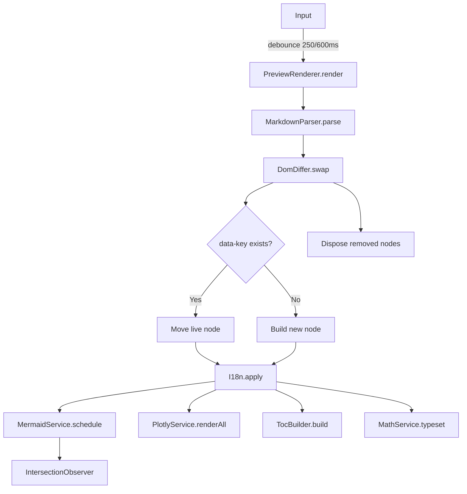

# 🏗️ Architecture

How the editor is built and how to extend it.

[← Back to README](../README.md)

---

## Table of Contents

- [Overview](#overview)
- [High-Level Flow](#high-level-flow)
- [File Structure](#file-structure)
- [Core Modules](#core-modules)
- [Rendering Pipeline](#rendering-pipeline)
- [Preprocessors — Order Matters](#preprocessors--order-matters)
- [Grid System](#grid-system)
- [Callouts & Tabs](#callouts--tabs)
- [Library (Documents)](#library-documents)
- [RTL & Direction Resolver](#rtl--direction-resolver)
- [Word Export Pipeline](#word-export-pipeline)
- [DomDiffer & `data-key`](#domdiffer--data-key)
- [Extension Points](#extension-points)
- [Storage](#storage)
- [Browser Support](#browser-support)
- [Performance](#performance)

---

## Overview

Vanilla JavaScript (ES2020+). No build step, no framework, no bundler.
Everything runs from a single `index.html` that loads modular scripts in
dependency order via `<script defer>`.

**Guiding principles:**

1. **Zero backend** — all state lives in `localStorage`.
2. **No build** — what you write is what the browser runs.
3. **Composable blocks** — every Markdown feature is a self-contained
   unit registered in a central registry.
4. **Content-addressed DOM** — identical content preserves its live
   nodes across renders (`data-key`).
5. **One direction policy per document** — `DirectionResolver` decides
   once, and every block consults it.

---

## High-Level Flow

```

          ┌─────────────────────────────────────────────┐
           │                 Editor (textarea)           │
           └──────────────────┬──────────────────────────┘
                              │ input (debounced 250/600 ms)
                              ▼
           ┌─────────────────────────────────────────────┐
           │           PreviewRenderer.render()          │
           └──────────────────┬──────────────────────────┘
                              │
                              ▼
           ┌─────────────────────────────────────────────┐
           │           MarkdownParser.parse()            │
           │  ┌───────────────────────────────────────┐  │
           │  │ Preprocessors (order-sensitive)       │  │
           │  │   footnotes → extractMath → grids     │  │
           │  │   → callouts → tabs                   │  │
           │  └───────────────────────────────────────┘  │
           │  ┌───────────────────────────────────────┐  │
           │  │ marked.lexer()                        │  │
           │  └───────────────────────────────────────┘  │
           │  ┌───────────────────────────────────────┐  │
           │  │ _processTokensToHtml()                │  │
           │  │   • grid markers → _renderGrid()      │  │
           │  │   • code tokens → BlockRegistry       │  │
           │  │   • rest → marked.parser(batch)       │  │
           │  └───────────────────────────────────────┘  │
           └──────────────────┬──────────────────────────┘
                              │ HTML string
                              ▼
           ┌─────────────────────────────────────────────┐
           │              DomDiffer.swap()               │
           │   (reuses live nodes by data-key)           │
           └──────────────────┬──────────────────────────┘
                              │
        ┌─────────────────────┼─────────────────────┐
        ▼                     ▼                     ▼

           I18n.apply() MermaidService PlotlyService
           .schedule() .renderAll()
        │                     │                     │
        └─────────────────────┼─────────────────────┘
                              ▼
                     TocBuilder.build()
                     MathService.typeset()
                     \_ensureModelViewer()

```

---

## File Structure

```

markdown-editor/
├── index.html ← Single entry point
├── README.md
├── prompt.md ← AI prompt for content generation
├── docs/ ← Per-feature documentation
│ ├── architecture.md ← this file
│ ├── callouts.md
│ ├── tabs.md
│ ├── grid.md
│ ├── library.md
│ ├── diagrams.md
│ ├── charts.md
│ ├── math.md
│ ├── maps.md
│ ├── media.md
│ ├── footnotes.md
│ ├── code-blocks.md
│ ├── tables-lists.md
│ ├── rtl-ltr.md
│ ├── export.md
│ └── shortcuts.md
├── tools/
│ └── download-vendors.sh
└── assets/
├── css/
│ ├── main.css ← Variables + reset + layout
│ ├── toolbar.css
│ ├── editor.css
│ ├── preview.css ← Base preview styles
│ ├── mermaid.css
│ ├── code.css
│ ├── stats.css
│ ├── library.css ← Library dropdown
│ └── render.css ← Callouts, tabs, grids, footnotes
├── vendor/
│ ├── marked.min.js
│ ├── highlight.min.js
│ ├── mermaid.min.js
│ ├── mathjax/
│ ├── plotly.min.js ← lazy
│ ├── docx.min.js ← lazy
│ ├── pptxgen.min.js ← lazy
│ └── model-viewer.min.js ← lazy
└── js/
├── core/
│ ├── logger.js ← Logger — level-gated output
│ ├── utils.js ← Utils — hash, SVG, blob, esc/attr
│ ├── event-bus.js ← EventBus + Events constants
│ ├── dom.js ← DOM cache + event delegation
│ ├── store.js ← Shared state + render tokens
│ └── lazy-loader.js ← LazyLoader — on-demand scripts
│
├── i18n/
│ ├── translations.js ← TRANSLATIONS
│ └── i18n.js ← I18n
│
├── content/
│ └── default-document.js ← DEFAULT_CONTENT (welcome doc)
│
├── services/
│ ├── theme.service.js ← ThemeService
│ ├── storage.service.js ← StorageService (legacy)
│ ├── mermaid.service.js ← MermaidService (queue + observer)
│ ├── plotly.service.js ← PlotlyService
│ └── math.service.js ← MathService
│
├── library/ ← Document library
│ └── library-manager.js ← LibraryManager
│
├── parser/
│ ├── highlighter.js ← Highlighter (hljs wrapper)
│ ├── preprocessors.js ← Preprocessors (all transforms)
│ ├── block-registry.js ← BlockRegistry + BaseBlock
│ ├── blocks/
│ │ ├── mermaid.block.js
│ │ ├── plotly.block.js
│ │ ├── map.block.js
│ │ ├── video.block.js
│ │ ├── model3d.block.js
│ │ └── code.block.js ← also the fallback
│ └── markdown-parser.js ← MarkdownParser
│
├── render/
│ ├── dom-differ.js ← DomDiffer (data-key reuse)
│ ├── toc-builder.js ← TocBuilder
│ └── preview-renderer.js ← PreviewRenderer
│
├── editor/
│ ├── format-commands.js ← FormatCommands
│ ├── editor-controller.js ← EditorController
│ ├── drag-drop.js ← DragDropHandler
│ └── code-runner.js ← CodeRunner (sandboxed iframe)
│
├── viewer/
│ ├── fullscreen-viewer.js ← FullscreenViewer
│ └── diagram-exporter.js ← DiagramExporter (PNG/SVG)
│
├── export/
│ ├── word/
│ │ ├── direction-resolver.js ← DirectionResolver
│ │ └── docx-builder.js ← DocxBuilder
│ ├── exporters/
│ │ ├── base.exporter.js
│ │ ├── markdown.exporter.js
│ │ ├── text.exporter.js
│ │ ├── word.exporter.js
│ │ ├── pdf.exporter.js
│ │ └── pptx.exporter.js
│ └── export-manager.js ← ExportManager
│
└── app.js ← MarkdownEditorApp (composition root)

```

---

## Core Modules

| Module       | Responsibility                                                                   |
| ------------ | -------------------------------------------------------------------------------- |
| `Logger`     | Level-gated output (`debug`, `info`, `warn`, `error`)                            |
| `Utils`      | Pure helpers: `hash`, `esc`, `attr`, `decodeHtmlEntities`, `dataUrlToUint8Array` |
| `EventBus`   | Pub/sub; also exports `Events` constants                                         |
| `DOM`        | Element cache + delegated click routing                                          |
| `Store`      | Shared state: `lastMarkdown`, render tokens, blob URLs                           |
| `LazyLoader` | Loads vendor scripts only when first needed                                      |

---

## Rendering Pipeline

**Entry point:** `PreviewRenderer.render()` — called on every input change
(after debounce).

**Steps:**

1. **Skip check** — if the Markdown hasn't changed and `force` is false,
   return early.
2. **Parse** — `MarkdownParser.parse(markdown)` produces an HTML string.
3. **Diff-swap** — `DomDiffer.swap(previewEl, html)` reuses live nodes
   whose `data-key` still matches.
4. **Re-apply i18n** — labels inside reused nodes may be stale.
5. **Schedule diagrams** — `MermaidService.schedule()` queues rendering
   for visible blocks only.
6. **Render charts** — `PlotlyService.renderAll()`.
7. **Build TOC** — `TocBuilder.build()`.
8. **Typeset math** — `MathService.typeset()`.
9. **Ensure `<model-viewer>`** — lazy-load if a 3D block exists.
10. **Update stats** — words / lines / chars.

**Full pipeline in one diagram:**



---

## Preprocessors — Order Matters

`Preprocessors` runs a sequence of text transforms **before** `marked.lexer`.
The order is load-bearing.

```
source
   │
   ├─▶ footnotes()      ─ supers, refs, definitions list
   │
   ├─▶ extractMath()    ─ protect $…$ / $$…$$ from marked
   │
   ├─▶ grids()          ─ :::grid  → marker + map  (structure only)
   │
   ├─▶ callouts()       ─ :::note  → single-line <div>
   │
   └─▶ tabs()           ─ === "…"  → single-line <div>
                            │
                            ▼
                       marked.lexer
```

### Why this order?

| Step          | Must run…                  | Reason                                                        |
| ------------- | -------------------------- | ------------------------------------------------------------- |
| `footnotes`   | first                      | Its `[^1]:` lines must not be touched by later transforms     |
| `extractMath` | before any HTML generation | Marked mangles `$` and `_`; protect early                     |
| `grids`       | before callouts/tabs       | Grid items must keep their **raw** container syntax for later |
| `callouts`    | before tabs                | Tabs may contain callouts; callouts never contain tabs        |
| `tabs`        | last                       | Tabs are top-level; nothing nests them                        |

**Never swap `grids` after `callouts`.** Grid items are re-parsed recursively
by the parser, and their content must reach the parser with `:::note` and
`=== "…"` still intact.

### Single-line HTML rule

`marked.lexer` splits an HTML block at the first blank line. Every
preprocessor that emits HTML must collapse newlines **outside** `<pre>`:

```js
Preprocessors._collapseNewlinesOutsidePre(html);
```

This is why callouts, tabs, and grids stay as one token each.

---

## Grid System

Grids are the most complex feature and deserve a dedicated pipeline.

### Syntax

```
:::grid columns=3 gap=16
:::item
Cell 1
:::
:::item span=2
Cell 2 (spans two columns)
:::
:::
```

### Why a map + marker?

`Preprocessors.grids()` **does not** call `marked.parse()` on item content.
Instead it:

1. Reads the grid, splits items, keeps each item's **raw Markdown**.
2. Stores the definition in a map: `{ columns, gap, items: [{ span, content }] }`.
3. Replaces the grid in the source with a **single-line marker**:
   `<!--MD-GRID:N-->`.

This preserves the raw Markdown for later, so every block inside a grid
(Mermaid, Plotly, code, callouts, nested grids) can be processed by the
**same renderer** as the outer document.

### Parser side

`MarkdownParser._processTokensToHtml()` scans every `html` token. When it
matches `<!--MD-GRID:N-->`, it calls `_renderGrid(gridDef, ctx)`.

`_renderGrid`:

- Normalizes `columns` (whitelist: integer 1–12, or `"Nfr Nfr …"`).
- Clamps `span` between `1` and column count.
- For each item, calls `_renderGridItem(item.content, parentCtx)`.

`_renderGridItem`:

- Runs the full preprocessor chain (`footnotes → extractMath → grids →
callouts → tabs`) on the item body.
- Builds a **child context** with its own `grids` map so nested markers
  resolve against the correct definitions.
- Recurses into `_processTokensToHtml`.

The result is that **a grid cell behaves like a mini-document**, with all
features working transparently.

### Word side

`DocxBuilder.doHtml()` recognizes the same `<!--MD-GRID:N-->` marker.
`_doGrid(gridDef)`:

1. Parses `columns` into `{ count, widths }` — `2fr 1fr` becomes
   `[66.67%, 33.33%]`.
2. Builds a borderless `Table` with `TableLayoutType.FIXED` so Word
   respects the proportions.
3. For each item, calls `_buildGridItemChildren(item.content, this.gridMap)`
   which re-runs the **DOCX** pipeline on the raw Markdown — so Mermaid
   becomes an `ImageRun`, tables become nested `Table`s, and code becomes
   syntax-highlighted paragraphs.
4. Sets `visuallyRightToLeft: this.dir.baseline` for RTL.

### Nested grids

The `gridMap` is a stack:

- **Parent** grid definitions are visible while processing an item.
- **Child** grid definitions are prepended to the child context.
- `try/finally` restores the parent map on exit.

This prevents marker index collisions.

---

## Callouts & Tabs

Both features use the same architecture as grids but with less machinery.

### Callouts

`Preprocessors.callouts()` is a line-based state machine:

- Recognizes `:::type optional-title` … `:::`.
- Emits a single-line `<div class="md-callout" data-callout="type">`.
- Body is parsed with `marked.parse`, then `_collapseNewlinesOutsidePre`
  keeps it on one line.

The Word exporter detects `data-callout="…"` and produces a
left-or-right-bordered paragraph with a header run.

### Tabs

`Preprocessors.tabs()` masks fenced code first (via `_maskFences`), then
expands `=== "Title"` blocks into a full `<div class="md-tabs">` markup.

The Word exporter emits each tab as a heading + body paragraph, since
Word has no tab widget.

**Both features call `_collapseNewlinesOutsidePre` or `_stripBlankLines`
before returning.** Otherwise `marked.lexer` splits them.

---

## Library (Documents)

`LibraryManager` is a thin wrapper around `localStorage`.

### Responsibilities

- Load/save a flat list of documents on every editor input (400 ms debounce).
- Expose `create`, `open`, `delete`, `list`, `getActive`, `saveCurrent`.
- Auto-title new documents from their first line.
- Seed a new document when the last one is deleted.

### Storage keys

| Key                       | Value                             |
| ------------------------- | --------------------------------- |
| `md-editor:docs:v1`       | JSON array of document objects    |
| `md-editor:active-doc:v1` | ID of the currently open document |

### Integration

- Constructed in `app.js` with `getEditor` / `setEditor` callbacks.
- `setEditor` writes to the textarea **and** calls `renderer.render({ force: true })`.
- `library.init()` runs **after** every service is built, so `setEditor`
  has a valid renderer to call.
- The menu UI is a dropdown rendered inside `#lib-menu`; clicks are delegated.

### Default content

`DEFAULT_CONTENT` (from `content/default-document.js`) is passed to the
library as `getDefaultContent`. It is used:

1. On first run (no documents in storage).
2. When the last document is deleted.

This guarantees the editor never opens to a blank library.

---

## RTL & Direction Resolver

Direction is **not** decided per element. `DirectionResolver` owns one
policy for the whole document.

### Baseline

Resolved once in `resolveDocument(markdown)`:

1. **Directive** — `<!-- dir: rtl -->` anywhere in the source.
2. **User mode** — `auto` / `rtl` / `ltr`.
3. **Auto-detect** — strong-character ratio; RTL if ≥ 25% of strong
   characters are RTL (low on purpose, to accommodate technical Arabic).

### Per-block policies

| Block        | Policy      | Behavior                                      |
| ------------ | ----------- | --------------------------------------------- |
| `heading`    | `baseline`  | Always follows the document                   |
| `paragraph`  | `deviating` | May flip if 85%+ one-sided **and** ≥ 25 chars |
| `list`       | `cohesive`  | One decision for the whole list               |
| `table`      | `cohesive`  | One decision for the whole table              |
| `blockquote` | `cohesive`  | One decision per quote                        |
| `code`       | `ltr`       | Always left-to-right                          |

### Run-level RTL

Independent of paragraph direction, every `TextRun` with RTL characters
gets `w:rtl` — handled in `DocxBuilder.run()` via `HAS_RTL_RE`.

### CSS side

The preview uses **logical properties** so RTL works automatically:

- `padding-inline-start` instead of `padding-left`
- `border-inline-start` instead of `border-left`
- `margin-inline-end` instead of `margin-right`

No `[dir="rtl"]` overrides are needed in CSS.

### Word side

`DocxBuilder.paragraphAuto()` sets `bidirectional: true` (Word's `w:bidi`).
No `w:jc="right"` is emitted — Word interprets `jc` in the context of
`bidi`, and that combination lands on the wrong edge.

---

## Word Export Pipeline

`DocxBuilder.build(markdown)` is a **separate pipeline** from the preview,
but consumes the same preprocessor output.

### Flow

```
markdown
   │
   ├─ Preprocessors.footnotes
   ├─ Preprocessors.grids          → { src, grids }  →  this.gridMap
   ├─ Preprocessors.callouts
   ├─ Preprocessors.tabs
   │
   ▼
marked.lexer(src)
   │
   ▼
processTokens(tokens)
   │
   ├─ heading     → doHeading
   ├─ paragraph   → doParagraph
   ├─ code        → doCode (with imageMap for Mermaid)
   ├─ blockquote  → doBlockquote
   ├─ list        → doList
   ├─ table       → doTable
   ├─ hr          → doHr
   ├─ html        → doHtml ─┬─ grid marker   → _doGrid
   │                        ├─ data-callout  → _doCallout
   │                        ├─ md-tabs       → _doTabs
   │                        └─ fallback      → paragraph
   └─ space       → doSpacer
```

### Key concepts

- **Images map** — `imageMap[mermaidIndex]` holds the pre-rendered SVG/PNG
  for every ` ```mermaid ` block, in order of appearance.
- **Run-level RTL** — `run()` attaches `w:rtl` to any run with RTL
  characters, without deciding the paragraph edge.
- **Paragraph direction** — `paragraphAuto()` calls `resolveBlock` and
  sets `bidirectional` on the `Paragraph`.
- **Fixed-layout tables** — Grid tables use `TableLayoutType.FIXED` so
  Word respects `columnWidths`.

---

## DomDiffer & `data-key`

`DomDiffer.swap(previewEl, newHtml)` compares the current DOM to the target
HTML and reuses nodes whose `data-key` matches.

### Key generation

```
data-key = prefix + cyrb53(block source content)
```

- `prefix` identifies the block type (`code-`, `mermaid-`, `tabs-`, …).
- `cyrb53` is a fast 53-bit hash.
- Duplicates in the same document get a `_N` suffix.

### Why it matters

A reused node keeps:

- Its `<svg>` (Mermaid).
- Its `<canvas>` (Plotly).
- Its `<iframe>` (video, model-viewer).
- Its `scrollTop`, focus, and any other live state.

Without `data-key`, every keystroke would rebuild every diagram and
destroy interactive state.

### Disposal

Nodes that disappear are disposed via `DomDiffer.defaultDispose`:

- `Plotly.purge()` on chart hosts.
- `iframe.src = "about:blank"` to release memory.

---

## Extension Points

### Adding a block type (e.g. ` ```csv `)

1. Create `assets/js/parser/blocks/csv.block.js`:

   ```js
   class CsvBlock extends BaseBlock {
     static langs = ["csv"];
     static render(tok, ctx) {
       return `<div class="csv-block">…</div>`;
     }
   }
   ```

2. Register in `MarkdownParser.createRegistry()`:

   ```js
   .register(CsvBlock);
   ```

3. Add a `<script>` tag in `index.html`.

4. (Optional) Add a Word handler in `DocxBuilder.doCode()` or `processToken`.

---

### Adding an export format

1. Create `assets/js/export/exporters/csv.exporter.js`:

   ```js
   class CsvExporter extends BaseExporter {
     static id = "csv";
     async run(markdown) {
       /* … */
     }
   }
   ```

2. Register in `ExportManager.createDefault()`:

   ```js
   .register(new CsvExporter());
   ```

3. Add `<li data-action="export" data-format="csv">` in `index.html`.

---

### Adding a language

1. Add a key in `i18n/translations.js`:

   ```js
   fr: { appTitle: "✦ Éditeur Markdown", /* … */ }
   ```

2. Add `"fr"` to `I18n.CYCLE`.

---

### Adding a formatting button

1. Add to `FormatCommands.WRAPS`:

   ```js
   highlight: { before: "==", after: "==" },
   ```

2. Add a button in HTML: `data-action="fmt" data-fmt="highlight"`.

---

### Adding a UI action

1. Add a key to `routes` in `app.js → _bindActions`.
2. Add `data-action="…"` in the HTML.

---

### Adding a preprocessor

1. Add a `static` method to `Preprocessors`.
2. Call it in the correct position in both:
   - `MarkdownParser.parse()`
   - `DocxBuilder.build()`

**Update both pipelines together.** A preprocessor that only runs in one
will produce inconsistent preview and export.

---

### Changing Mermaid colors

Edit `baseConfig.themeVariables` in `services/mermaid.service.js`.

---

### Enabling verbose logging

In the browser console:

```js
Logger.level = "debug";
```

---

## Storage

Two independent storage systems coexist:

| System           | Key pattern         | Purpose                          |
| ---------------- | ------------------- | -------------------------------- |
| `StorageService` | `md-editor:content` | Legacy single-document backup    |
| `LibraryManager` | `md-editor:docs:v1` | Multi-document library (current) |

`LibraryManager` is the active store. `StorageService` remains for backward
compatibility and as a fallback if the Library is disabled.

### Autosave

- **Debounce:** 400 ms.
- **On quota error:** indicator switches to `⚠️ Error`, write fails
  silently, previous state remains in memory.
- **Indicator states:** ⏳ saving / 💾 saved / ⚠️ error.

---

## Browser Support

| Browser | Minimum |
| ------- | ------- |
| Chrome  | 90+     |
| Firefox | 88+     |
| Safari  | 14+     |
| Edge    | 90+     |

Required Web APIs:

- `IntersectionObserver`
- `ResizeObserver`
- `Blob` / `URL.createObjectURL`
- `localStorage`
- CSS `content-visibility`
- CSS logical properties (`padding-inline-start`, `border-inline-start`)

---

## Performance

### Input debounce

- **Small docs** (< 2 KB): 250 ms.
- **Large docs**: 600 ms.

Adaptive debounce is handled inside `PreviewRenderer`.

### Lazy rendering

- `content-visibility: auto` on `.mm-wrap` and `.code-wrap` — off-screen
  blocks are skipped for layout and paint.
- `IntersectionObserver` with `rootMargin: 800px` — Mermaid/Plotly render
  only when near the viewport.

### DOM reuse

`DomDiffer` moves nodes instead of rebuilding them whenever `data-key`
matches. This is what keeps SVG, canvas, and iframes alive across edits.

### Vendor loading

- **Eager**: `marked`, `highlight.js`, `mermaid`, `MathJax` (needed for
  first paint).
- **Lazy**: `plotly`, `docx`, `pptxgenjs`, `model-viewer` (loaded only
  when first needed by `LazyLoader`).

### Yield points

Mermaid rendering uses a sequential queue with `yield` between diagrams,
so a document with 20 diagrams does not block the main thread.

---

[← Back to README](../README.md)
