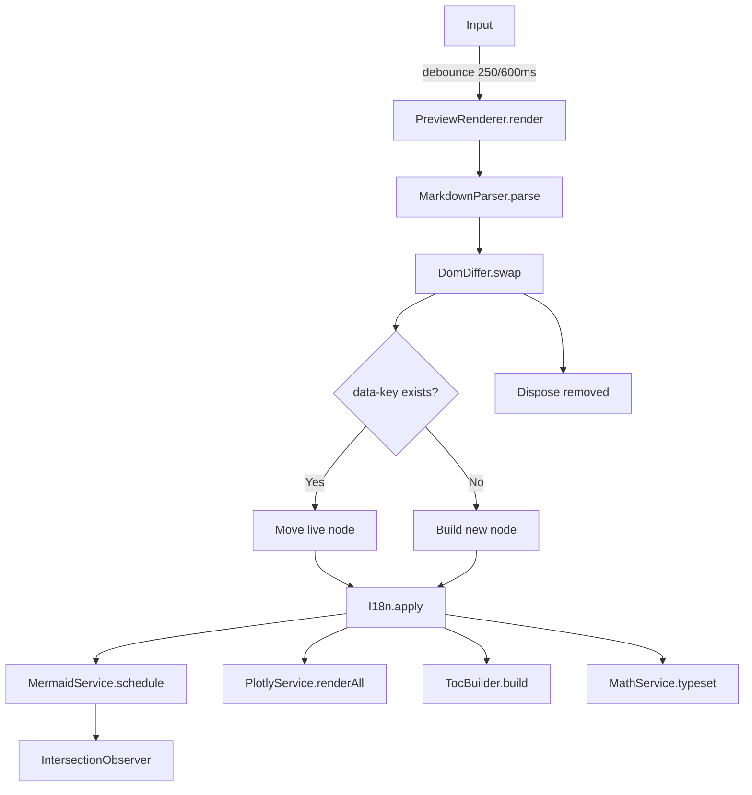

# 🏗️ Architecture

How the editor is built and how to extend it.

[← Back to README](../README.md)

---

## Overview

Vanilla JavaScript (ES2020+), no build step, no framework. Everything runs
from a single `index.html` that loads modular scripts in dependency order.

```

Editor (textarea)
│
▼
PreviewRenderer.render()
│
├── MarkdownParser.parse()
│ ├── Preprocessors.footnotes()
│ ├── Preprocessors.extractMath()
│ ├── Preprocessors.callouts()
│ ├── Preprocessors.tabs()
│ ├── marked.lexer()
│ └── BlockRegistry.render() for each code token
│
├── DomDiffer.swap() ← preserves live nodes via data-key
│
├── I18n.apply()
├── MermaidService.schedule()
├── PlotlyService.renderAll()
├── TocBuilder.build()
└── MathService.typeset()

```

---

## Rendering Pipeline



The **`data-key`** is a content hash:

prefix + cyrb53(block content)

As long as the source content is unchanged, the node is **moved**, not rebuilt
— preserving SVGs, iframes, and interactive state.

---

## Core Modules

| Module       | Responsibility                   |
| ------------ | -------------------------------- |
| `Logger`     | Controlled output by log level   |
| `Utils`      | Pure functions (hash, SVG, blob) |
| `EventBus`   | Pub/sub                          |
| `DOM`        | Cache + event delegation         |
| `Store`      | Shared state                     |
| `LazyLoader` | Load vendor libraries on demand  |

---

## Extension Points

### Adding a block type

1. Create `assets/js/parser/blocks/csv.block.js`:

   ```js
   class CsvBlock extends BaseBlock {
     static langs = ["csv"];
     static render(tok, ctx) {
       return `<div class="csv-block">…</div>`;
     }
   }
   ```

2. Register in `MarkdownParser.createRegistry()`:

   ```js
   .register(CsvBlock)
   ```

3. Add the `<script>` tag in `index.html`.

---

### Adding an export format

1. Create `assets/js/export/exporters/csv.exporter.js`:

   ```js
   class CsvExporter extends BaseExporter {
     static id = "csv";
     async run(markdown) {
       /* … */
     }
   }
   ```

2. Register in `ExportManager.createDefault()`:

   ```js
   .register(new CsvExporter());
   ```

3. Add `<li data-action="export" data-format="csv">` in `index.html`.

---

### Adding a language

1. Add a key in `i18n/translations.js`:

   ```js
   fr: { appTitle: "✦ Éditeur Markdown", /* … */ }
   ```

2. Add `"fr"` to `I18n.CYCLE`.

---

### Adding a formatting button

1. Add to `FormatCommands.WRAPS`:

   ```js
   highlight: { before: "==", after: "==" },
   ```

2. Add a button with `data-action="fmt" data-fmt="highlight"`.

---

### Adding a UI action

1. Add a key to `routes` in `app.js` → `_bindActions`.
2. Add a `data-action="…"` attribute in the HTML.

---

### Changing Mermaid colors

Edit `baseConfig.themeVariables` in `services/mermaid.service.js`.

---

### Enabling verbose logging

In the console:

Logger.level = "debug";

---

## Autosave

`StorageService` saves the document to `localStorage` on every change,
debounced to ~800ms. The indicator shows:

- 💾 **Saved** — last write succeeded
- ⚠ **Quota exceeded** — 5 MB limit reached
- ⚠ **Save failed** — other error

---

## Scroll Sync

When enabled, `ScrollSync` maps the editor's scroll position to the preview
using a normalized ratio. Toggle with the 🔗 button in the toolbar.

---

## Zen Mode

Hides the toolbar, plabels, and status bar; widens the writing column;
dims the preview. Toggle with `Ctrl+Shift+Z` or the 🧘 button.

---

## File Structure

assets/js/
├── core/ # Infrastructure (logger, utils, bus, dom, store)
├── i18n/ # Translations + language cycling
├── content/ # Default document
├── services/ # Theme, storage, mermaid, plotly, math
├── parser/ # Markdown parsing + block registry
│ ├── blocks/ # Mermaid, Plotly, Map, Video, 3D, Code
│ └── preprocessors.js
├── render/ # DomDiffer, TocBuilder, PreviewRenderer
├── editor/ # FormatCommands, EditorController, CodeRunner
├── viewer/ # FullscreenViewer, DiagramExporter
├── export/ # Word, PDF, PPTX, Markdown, Text
└── app.js # Composition root

---

## Browser Support

| Browser | Minimum |
| ------- | ------- |
| Chrome  | 90+     |
| Firefox | 88+     |
| Safari  | 14+     |
| Edge    | 90+     |

Required APIs:

- `IntersectionObserver`
- `ResizeObserver`
- `Blob` / `URL.createObjectURL`
- `localStorage`
- CSS `content-visibility`
- CSS logical properties (`padding-inline-start`)

---

## Performance

- **Debounced input** — 250ms (small docs) / 600ms (large)
- **content-visibility: auto** — skips rendering off-screen blocks
- **IntersectionObserver** — renders Mermaid/Plotly only when visible
- **DOM diffing** — reused nodes preserve their state
- **Lazy loading** — heavy libraries loaded on demand

[← Back to README](../README.md)
