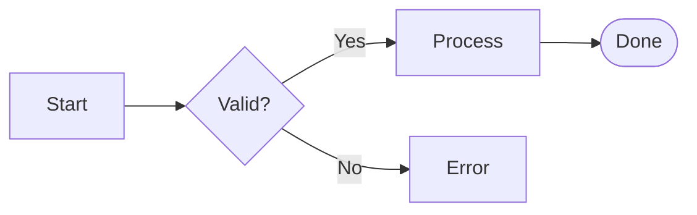
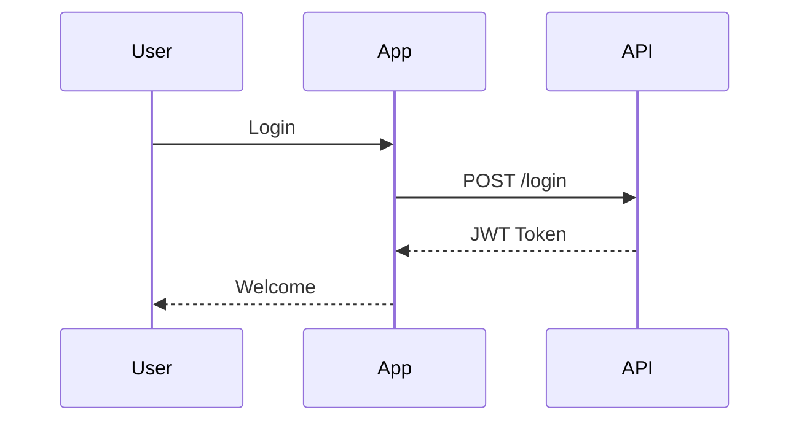
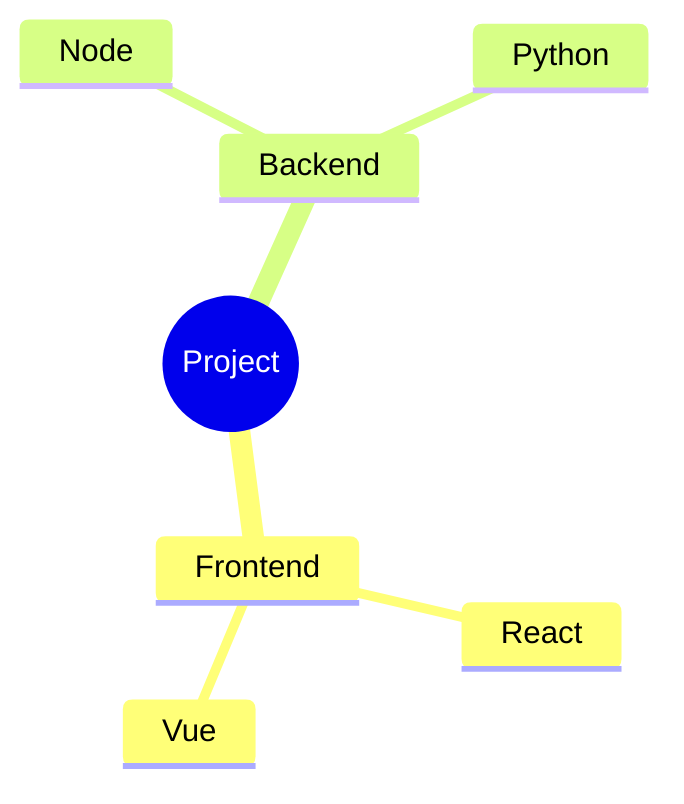
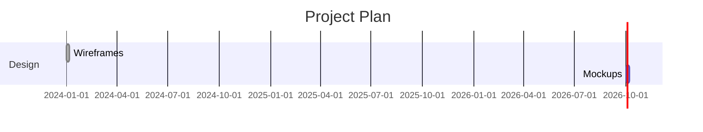

# 📊 Mermaid Diagrams

Render diagrams from text. All **22+ Mermaid diagram types** are supported.

[← Back to README](../README.md)

---

## Supported Types

| Type                | Keyword              | Status |
| ------------------- | -------------------- | :----: |
| Flowchart           | `flowchart TD`       |   ✅   |
| Sequence            | `sequenceDiagram`    |   ✅   |
| Class               | `classDiagram`       |   ✅   |
| State               | `stateDiagram-v2`    |   ✅   |
| Entity-Relationship | `erDiagram`          |   ✅   |
| Gantt               | `gantt`              |   ✅   |
| Pie                 | `pie`                |   ✅   |
| Mindmap             | `mindmap`            |   ✅   |
| Timeline            | `timeline`           |   ✅   |
| Git Graph           | `gitGraph`           |   ✅   |
| User Journey        | `journey`            |   ✅   |
| Quadrant            | `quadrantChart`      |   ✅   |
| XY Chart            | `xychart-beta`       |   ✅   |
| Sankey              | `sankey-beta`        |   ✅   |
| Treemap             | `treemap-beta`       |   ✅   |
| Radar               | `radar-beta`         |   ✅   |
| Kanban              | `kanban`             |   ✅   |
| Packet              | `packet-beta`        |   ✅   |
| Block               | `block-beta`         |   ✅   |
| Architecture        | `architecture-beta`  |   ✅   |
| Requirement         | `requirementDiagram` |   ✅   |
| C4                  | `C4Context`          |   ✅   |

---

## Quick Examples

### Flowchart

### Sequence

### Mindmap

### Gantt

---

## Fullscreen Viewer

Click the ⛶ button on any rendered diagram to open it in a fullscreen
viewer with:

- **Zoom** (mouse wheel)
- **Pan** (drag)
- **Fit to view** (`0` key)
- **Export PNG / SVG**
- **Close** (`Esc`)

---

## Theming

Diagram colors follow the current theme (light/dark). To customize them,
edit `assets/js/services/mermaid.service.js` → `baseConfig.themeVariables`.

---

## All Diagram Types

A complete sample document with **30 production-ready examples** covering
every Mermaid type is available in
[`assets/js/content/default-document.js`](../assets/js/content/default-document.js).

[← Back to README](../README.md)
