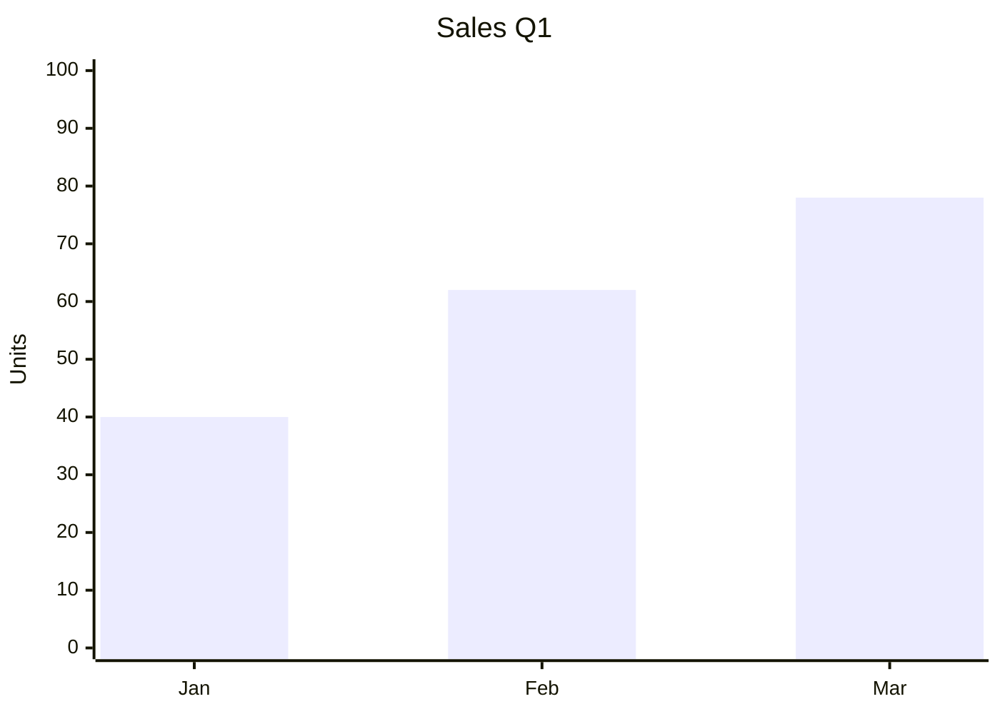

# 📐 Grid Layout

Arrange independent Markdown blocks side by side using a CSS Grid
container. Ideal for KPI cards, chart + table layouts, sidebars,
and nested dashboards.

[← Back to README](../README.md)

---

## Syntax

```
:::grid columns=3 gap=16

:::item
Content of cell 1
:::

:::item
Content of cell 2
:::

:::item
Content of cell 3
:::

:::
```

Each `:::item` becomes one grid cell. The `:::grid` block itself is
the container. Both `:::item` and `:::` closings are required.

---

## Attributes

### On `:::grid`

| Attribute | Type            | Default | Description                                          |
| --------- | --------------- | ------- | ---------------------------------------------------- |
| `columns` | integer (1–12)  | `2`     | Number of equal-width columns                        |
| `columns` | `"Nfr Nfr ..."` | —       | Fractional track list (`"2fr 1fr"`, `"1fr 2fr 1fr"`) |
| `gap`     | integer (px)    | `16`    | Space between cells                                  |

### On `:::item`

| Attribute | Type          | Default | Description                         |
| --------- | ------------- | ------- | ----------------------------------- |
| `span`    | integer (1–N) | `1`     | Make the cell span multiple columns |

> Invalid values are normalized: an unknown `columns` value falls back
> to `repeat(2, minmax(0, 1fr))`, and a `span` larger than the column
> count is clamped.

---

## Examples

### 1. Three equal columns

```markdown
:::grid columns=3 gap=16

:::item

### Total Sales

**1,250,000 SAR**
:::

:::item

### Customers

**8,420**
:::

:::item

### Growth

**+18.4%**
:::

:::
```

Renders as three equal KPI cards.

### 2. Two columns with mixed content

````markdown
:::grid columns=2 gap=16

:::item

#### Q1 Sales



:::

:::item

#### Sales Detail

| Month | Units | Growth |
| :---: | :---: | :----: |
|  Jan  |  40   |   —    |
|  Feb  |  62   |  +55%  |
|  Mar  |  78   |  +26%  |

:::

:::
````

Chart and table side by side.

### 3. Fractional widths (`2fr 1fr`)

```markdown
:::grid columns="2fr 1fr" gap=20

:::item

### Main Content (⅔)

This column takes two-thirds of the width.
:::

:::item

### Sidebar (⅓)

This column takes one-third.
:::

:::
```

### 4. Span across columns

```markdown
:::grid columns=3 gap=16

:::item span=2

## Wide Header

This cell spans two columns.
:::

:::item

## Normal

This cell is one column.
:::

:::
```

### 5. Nested grids

```markdown
:::grid columns=2 gap=16

:::item

### Section A

:::grid columns=2 gap=8
:::item
Option 1
:::
:::item
Option 2
:::
:::
:::

:::item

### Section B

Regular text.
:::

:::
```

Nested grids are fully supported. Each nested grid keeps its own
`columns`, `gap`, and `span` values.

### 6. Single column (stacked layout)

```markdown
:::grid columns=1 gap=8

:::item
**Step 1.** Install dependencies.
:::

:::item
**Step 2.** Run the build.
:::

:::item
**Step 3.** Deploy.
:::

:::
```

Useful for step-by-step guides and callout sequences.

### 7. Callout inside a cell

```markdown
:::grid columns=2 gap=16

:::item
:::warning
This cell contains a callout.
:::
:::

:::item
Regular paragraph.
:::

:::
```

Any block supported by the editor works inside a cell.

---

## Supported content

Every cell can contain **any** supported Markdown block:

| Content          | Works in cell |
| ---------------- | :-----------: |
| Paragraphs       |      ✅       |
| Headings (H1–H6) |      ✅       |
| Bold / italic    |      ✅       |
| Inline code      |      ✅       |
| Links            |      ✅       |
| Images           |      ✅       |
| Lists            |      ✅       |
| Task lists       |      ✅       |
| Tables           |      ✅       |
| Blockquotes      |      ✅       |
| Footnotes        |      ✅       |
| Code blocks      |      ✅       |
| Math (LaTeX)     |      ✅       |
| Mermaid diagrams |      ✅       |
| Plotly charts    |      ✅       |
| Maps             |      ✅       |
| Callouts         |      ✅       |
| Tabs             |      ✅       |
| Nested grids     |      ✅       |

---

## Behavior

### Responsive layout

On narrow screens (≤720px), grids automatically collapse to a single
column regardless of the `columns` value. This ensures readability on
mobile devices.

### Print / PDF

When printing or exporting to PDF:

- Every cell keeps its own content intact.
- Grid cells are prevented from breaking across pages
  (`break-inside: avoid`).
- The layout is preserved exactly as seen in the preview.

### Word export

In `.docx` export, each grid becomes a **Word Table** with:

- Fixed column widths derived from the `columns` spec.
- `2fr 1fr` translated to real proportions (66.67% / 33.33%).
- Borderless cells — the table exists only for layout.
- Cell content re-processed through the full DOCX pipeline, so
  Mermaid, Plotly, tables, code blocks, and callouts render as native
  Word objects inside the cells.

### RTL support

In RTL documents:

- The column order is **visually reversed** — the first cell appears
  on the right.
- The paragraph direction inside each cell follows the document
  baseline via `DirectionResolver`.

### Dark mode

The grid container has no visible background or border in either
theme. Only the cells' own content is styled — matching the surrounding
document.

---

## Tips

- **Keep cell counts balanced** — 2, 3, or 4 columns read best.
- **Use `gap=8` for nested grids** inside a `gap=16` parent to
  create visual hierarchy.
- **Don't nest more than 2 levels deep** — it becomes hard to read.
- **Prefer `columns=2` over `"1fr 1fr"`** — both are equal, but the
  integer form is more readable.
- **Empty cells are allowed** — they reserve space and keep the
  layout intact.
- **A grid with a single item works** — useful when you want an
  isolated card with padding.

---

## Common mistakes

### ❌ Missing `:::item` wrappers

```markdown
:::grid columns=2
Content A

Content B
:::
```

Without `:::item`, all content goes into **one** implicit cell.
Always wrap items explicitly.

### ❌ Mismatched closings

```markdown
:::grid columns=2
:::item
Content
:::
```

This is missing the grid's closing `:::`. The parser will consume
everything after it as part of the grid.

### ❌ Invalid `columns` value

```markdown
:::grid columns="auto"
```

Unknown values fall back to two equal columns. Use integers
(`1`–`12`) or `fr`-based track lists (`"2fr 1fr"`).

---

## Related

- [Tabs](tabs.md) — tabbed content inside a cell
- [Callouts](callouts.md) — callouts inside a cell
- [Mermaid Diagrams](diagrams.md) — diagrams as cell content
- [Export](export.md) — how grids export to Word/PDF

[← Back to README](../README.md)
