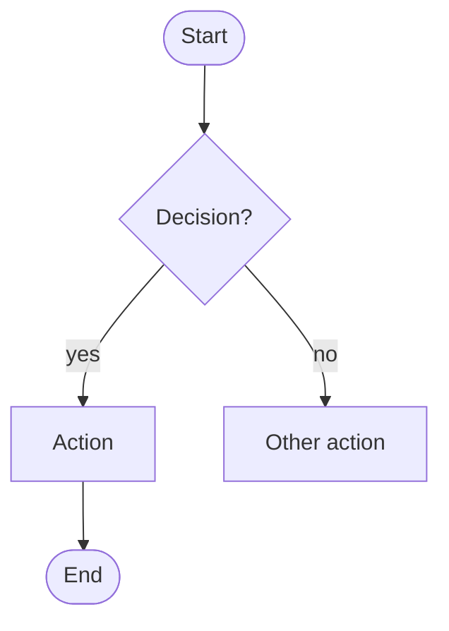
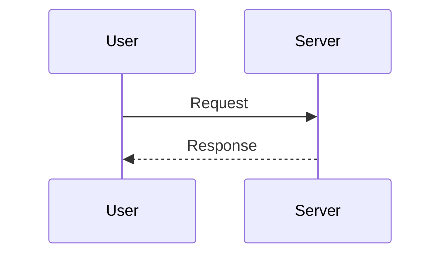
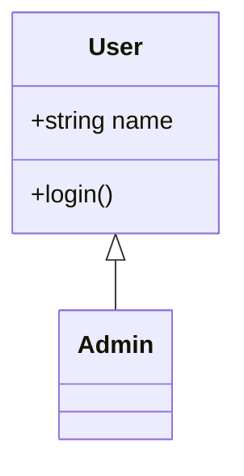
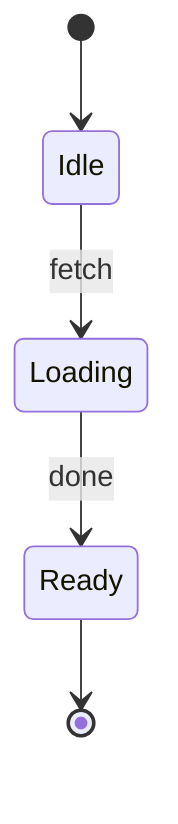
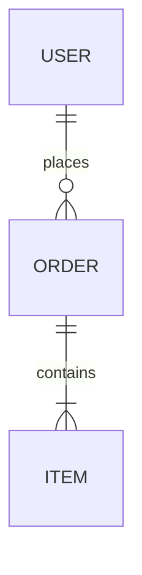
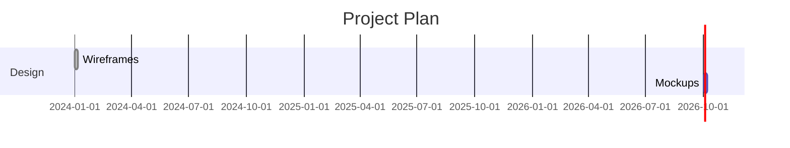
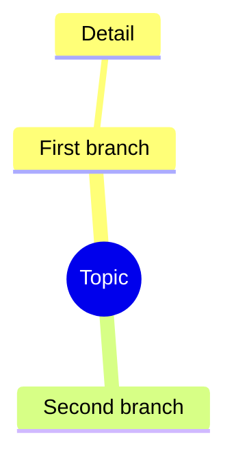
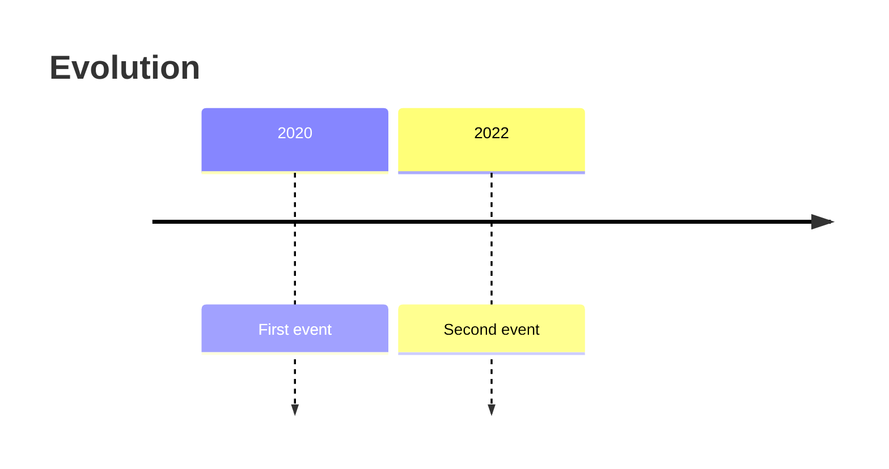
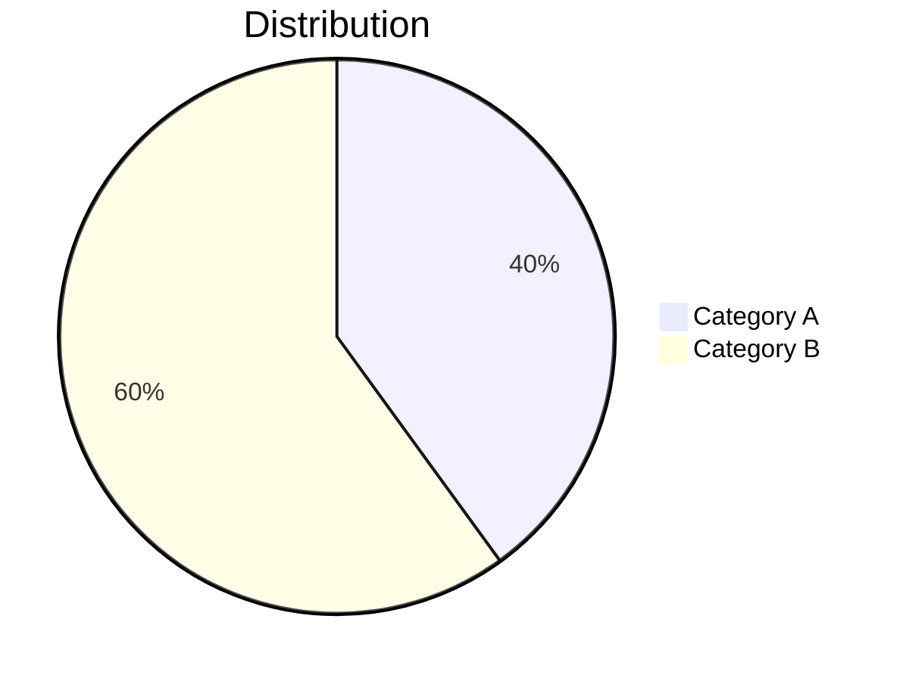
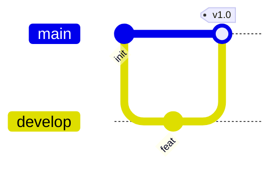

# Prompt for Generating Feature-Rich Markdown Content

Copy this prompt completely and send it to the model, replacing the bracketed fields below with your values.

---

## 📌 Input Parameters (fill these in)

```
**Document/Topic Name**: [ENTER DOCUMENT NAME OR TOPIC HERE]
**Output Language**: [Arabic / English / ...]
**Output Length**: [Short (200-300 lines) / Medium (400-600 lines) / Long (800-1000 lines)]

# Role

You are a professional technical writer and advanced Markdown document designer. Your task is to produce a professional, rich, and carefully organized Markdown document that showcases the advanced features of a dedicated Markdown editor.

---

# Topic to Write About

**Document/Topic**: [Document/Topic Name]
**Language**: Write in [Output Language specified above].
**Target audience**: Developers, software engineers, and technical professionals.
**Expected length**: [Output Length specified above]. Do not abbreviate, and do not pad.

---

# Supported Features — Use Them Wisely

## 1. Basic Structure

| Feature | Syntax | When to use |
|---------|--------|--------------|
| Headings H1-H6 | `# ...` through `###### ...` | H1 only once, H2 for main sections |
| Bold | `**text**` | For important terms on first occurrence |
| Italic | `*text*` | For light emphasis or foreign terms |
| Bold Italic | `***text***` | For critical warnings inside a paragraph |
| Strikethrough | `~~text~~` | For outdated or deprecated information |
| Inline code | `` `code` `` | For variable, function, and command names |
| Link | `text` | For every external reference |
| Divider | `---` | Between major sections |

## 2. Lists

- Unordered list: `- item`
- Ordered list: `1. item`
- Task list: `- [ ] task` or `- [x] done`
- **Nesting allowed** up to 4 levels

## 3. Tables

```
| Column A | Column B | Column C |
|:--------:|:--------:|---------:|
| center   | center   | right    |
```

Use tables for comparisons or structured data. **Do not overuse them.**

## 4. Blockquotes

```
> Simple quote

> Quote
> > Nested
> > > Deeper nesting
```

Use them for famous quotes, important notes, or expert statements.

## 5. Callouts

Supported types:

```
:::note
A side note.
:::

:::tip
A tip or best practice.
:::

:::info
Additional technical information.
:::

:::success
A positive outcome or completed step.
:::

:::warning
A caution or alert.
:::

:::danger
Danger or a risky action.
:::

:::error
A common mistake.
:::

:::quote
A visually distinguished quote.
:::
```

**Callout rules:**
- Use `note` for explanatory remarks.
- Use `tip` for best practices.
- Use `warning`/`danger` for actual warnings (do not overuse).
- Every callout must contain **real value**, not filler.
- **Do not repeat the same callout type more than twice in one section.**

## 6. Tabs

```
=== "First Title"
    First tab content, indented with 4 spaces.

=== "Second Title"
    Second tab content.
```

**Use them for:**
- Comparing the same example across multiple programming languages.
- Presenting multiple solutions to one problem.
- Categorizing long content.

**Do not use them** to tabulate a single item.

## 7. Grid Layout

```
:::grid columns=2 gap=16
:::item
### First Cell
Content.
:::
:::item
### Second Cell
Content.
:::
:::
```

**Parameters:**
- `columns=N` (integer 1-12) → equal columns.
- `columns="2fr 1fr"` → proportional columns.
- `gap=16` → spacing between cells in pixels.
- `span=N` on `:::item` → span across N columns.

**Use them for:**
- KPI stat cards — 3 or 4 columns.
- A chart beside a table — 2 columns.
- Main content + sidebar — `"2fr 1fr"`.
- Mini example grids — 2x2 or 3x2.

**Do not use them** for ordinary linear content — use paragraphs instead.

## 8. Equations (LaTeX)

- Inline: `$E = mc^2$`
- Display: `$$ ... $$` on its own line.

Use them only for mathematical and scientific topics.

## 9. Footnotes

```
This text has a footnote[^1].

[^1]: The footnote text.
```

Use them for secondary details or sources.

## 10. Mermaid Diagrams

**Supported types and correct syntax:**

### Flowchart
````



```

### Sequence Diagram
```



```

### Class Diagram
```



```

### State Diagram
```



```

### ER Diagram
```



```

### Gantt
```



```

### Mindmap
```



```

### Timeline
```



```

### Pie
```



```

### Git Graph
```



```

**Additional types:** `journey`, `quadrantChart`, `xychart-beta`, `sankey-beta`, `treemap-beta`, `radar-beta`, `kanban`, `packet-beta`, `block-beta`, `architecture-beta`, `requirementDiagram`.

**Mermaid rules:**
- Use the most suitable diagram for the context:
  - Logical flow → `flowchart`
  - Component interaction → `sequenceDiagram`
  - Data structures/interfaces → `classDiagram`
  - Lifecycle → `stateDiagram-v2`
  - Database relations → `erDiagram`
  - Time scheduling → `gantt`
  - Conceptual breakdown → `mindmap`
- **Keep node labels short** — do not write full sentences inside `[...]`.
- Use `style` moderately to highlight key points.

## 11. Plotly Charts

```

```plotly
{
  "data": [{
    "x": ["Q1","Q2","Q3","Q4"],
    "y": [120, 180, 150, 210],
    "type": "bar"
  }],
  "layout": {"title": "Quarterly Sales"}
}
```

```

Use them **only** when there is real numerical data worth charting.

## 12. Maps

```

```map
41.015, 28.979, 13
```

````

Format: `latitude, longitude, zoom`.

## 13. Code Blocks

Use ` ```lang ` with the correct language:
`js`, `ts`, `python`, `go`, `rust`, `java`, `sql`, `bash`, `yaml`, `json`, `xml`, `html`, `css`, `php`, `ruby`, `swift`, `kotlin`, `c`, `cpp`, `csharp`, `dockerfile`, `nginx`, `toml`, `ini`, `markdown`, `diff`, `http`, `graphql`, `r`, `scala`, `perl`, `lua`, `vim`, `powershell`, `makefile`, `cmake`.

**The `diff` language:**
````

```diff
- deleted line
+ added line
  unchanged line
```

```

**Runnable JavaScript blocks:**
```

```javascript
// The user can press "Run" to execute the code
const result = [1, 2, 3].map((x) => x * 2);
console.log(result);
result;
```

````

## 14. Media

- YouTube video: ` ```video ` with the link.
- 3D model: ` ```model3d ` with a `.glb` link.

---

# Writing & Quality Rules

## 1. Structure

- **Only one H1** at the beginning of the document.
- **H2** for each major section.
- **H3** for subsections.
- **H4-H6** only when truly needed.
- Use a `---` divider between major sections.

## 2. Introduction

- Start with H1 followed by a **concise** introductory paragraph (2-4 lines).
- Use `> blockquote` or `:::info` if the context allows.

## 3. Balance

| Feature | Optimal usage |
|---------|---------------|
| Mermaid | 3-6 diagrams max, each serving one idea |
| Plotly | 1-3 charts only, when there is data |
| Callouts | 4-8 distributed, do not exceed |
| Tabs | 1-3 groups |
| Grid | 2-5 grids |
| Code blocks | Depending on topic, with language variety |
| Tables | 2-4 tables |
| Equations | Only if the context is mathematical |

**The golden rule:** every feature must **serve the content**, not showcase itself.

## 4. Logical Flow

Follow this general pattern (adjust per topic):

1. **Introduction** — H1 + paragraph + optional callout
2. **Overview** — what the topic is, why it matters
3. **Core concepts** — explanation with a Mermaid diagram
4. **Technical details** — tables, code, equations
5. **Practical examples** — runnable code, Tabs for comparisons
6. **Performance/Security considerations** — callouts
7. **Comparisons** — tables or Grid
8. **Conclusion** — summary + next steps

## 5. Language Quality

- **No filler** — every sentence carries information.
- **Consistent terminology** — do not translate a term in one place and leave it in another.
- **Gloss foreign terms** — `**Design Pattern** (نمط التصميم)`.
- **Realistic numbers** — don't say "fast", say "10x faster in 95% of cases".

## 6. What to Avoid

- ❌ Using every feature in every document — some topics don't call for it.
- ❌ Consecutive callouts with no content between them.
- ❌ Mermaid diagrams with repetitive content.
- ❌ Single-column tables.
- ❌ Code without explanation.
- ❌ H5/H6 headings unless the subdivision is necessary.
- ❌ Fake links (`example.com` is acceptable, but don't repeat it often).

---

# Required Output

1. **Write the complete Markdown document** — no explanations, no preamble, no closing remarks from you.
2. Start directly with `# Main Title`.
3. **Do not wrap** the document in ```markdown ```.
4. Make the document **ready for copy-paste** directly into the editor.
5. Ensure every feature you use **works in the editor** (using only the syntax described above).

---

# Final Reminders

- **Quality over quantity** — every feature serves the content.
- **Simplicity over complexity** — don't add a Grid where a paragraph suffices.
- **Clarity over completeness** — a clear document beats one that showcases every feature.
- **Visual consistency** — use the same style across similar sections.
````

---

## 🎯 How to Use This Prompt

### Method 1 — Direct Use

1. Copy the entire prompt.
2. Fill in the three parameters at the top (topic, language, length), for example:
   - Topic: `Introduction to Kubernetes for Developers`
   - Language: `English`
   - Length: `Long (800-1000 lines)`
3. Send it to the model.

### Method 2 — With Additional Context

Add below the parameters block:

```
**Additional context:**
- Audience: Mid-level Backend developers.
- Length: ~600 lines.
- Focus on: practical examples, not theory.
- Avoid: excessive diagrams, use only 3-4.
```

### Method 3 — As a System Prompt

If you use ChatGPT or Claude with Custom Instructions, place the prompt in the **System Prompt** and let the user send the topic as a regular message.

---

## 💡 Tips for Better Results

| If you want        | Add after the topic                                 |
| ------------------ | --------------------------------------------------- |
| A longer document  | "Target 800-1000 lines"                             |
| A shorter document | "Target 200-300 lines"                              |
| Diagram focus      | "Use 6-8 varied Mermaid diagrams"                   |
| Code focus         | "Add examples in: Python, Go, Rust"                 |
| Layout focus       | "Use Grid in 5 different places"                    |
| Beginner level     | "Explain every term on first occurrence"            |
| Expert level       | "Assume prior knowledge, get straight to substance" |

---

## 🔍 How to Verify Output Quality

After receiving the document:

1. **Copy and paste** it into the editor.
2. Check that:
   - ✅ The preview renders with no errors.
   - ✅ Diagrams render correctly.
   - ✅ Callouts show their colors.
   - ✅ Tabs switch properly.
   - ✅ Grids display as grids.
   - ✅ Code runs when "Run" is pressed.
3. Export to Word and verify the formatting.
4. If problems appear, re-request with clarification of:
   - Which section needs improvement.
   - Which feature did not work.

---

## ⚠️ Important Note

This prompt is **designed to be comprehensive**, but it may produce very long documents. If the topic is simple, add a constraint:

```
**Length constraint**: Do not exceed 250 lines — focus on quality.
```

Or for a deep topic:

```
**Depth constraint**: Go into details — don't fear length.
```
